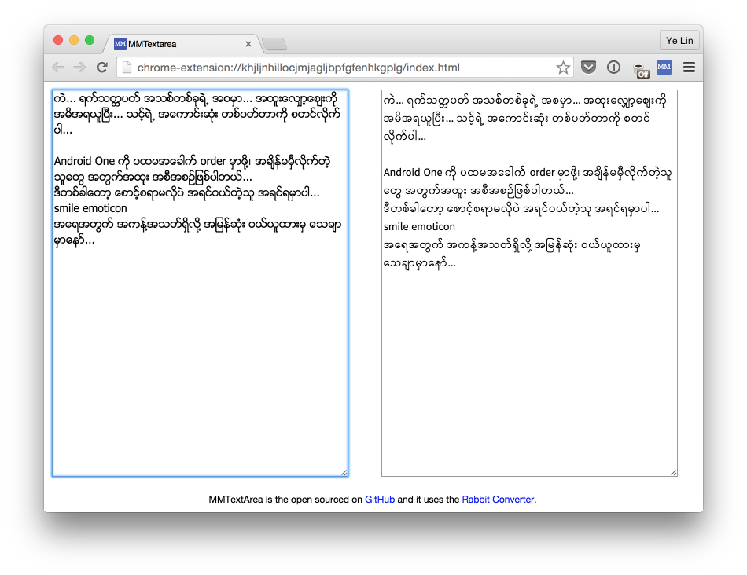

# MMTextArea-Chrome

Easily convert between ZG and Unicode in a new Tab. For Google Chrome.

## Install

Download [zip](https://github.com/yelinaung/MMTextArea-Chrome/archive/master.zip) file and unzip it.

1. Go to Tools > Extensions inside Chrome by clicking on the wrench icon on top right.
2. Select "Load unpacked extension"
3. Select the "mmtextarea" folder with manifest.json in it's root
4. MMTextArea will be installed as a developer extension.

Installation via Chrome Web Store will be coming soon.

## Credits

It uses the [Rabbit Converter](https://github.com/Rabbit-Converter/Rabbit).

## Contributing

1. Fork it (https://github.com/yelinaung/MMTextArea-Chrome)
2. Create your feature branch (`git checkout -b my-new-feature`)
3. Commit your changes (`git commit -am 'Added some feature'`)
4. Push to the branch (`git push origin my-new-feature`)
5. Create new Pull Request

## License

MIT
